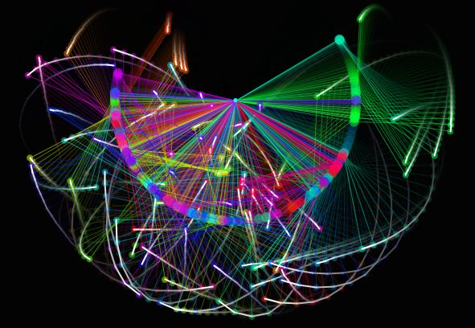

# double-pendulum

Physics simulation of double pendulums.
The special ability of this program is showing the chaos in the system:
by simulating a few dozen pendulums with a tiny variance in their initial conditions causes significant deviations during just a few back-and-forth oscillations.

